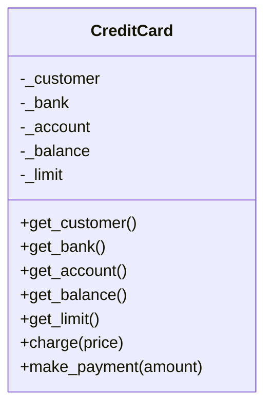
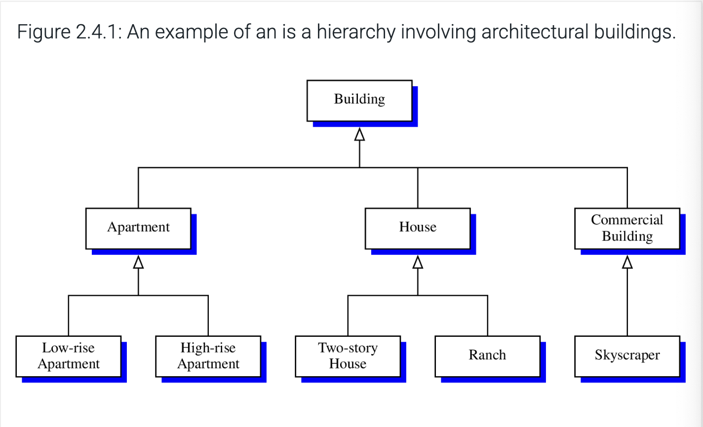
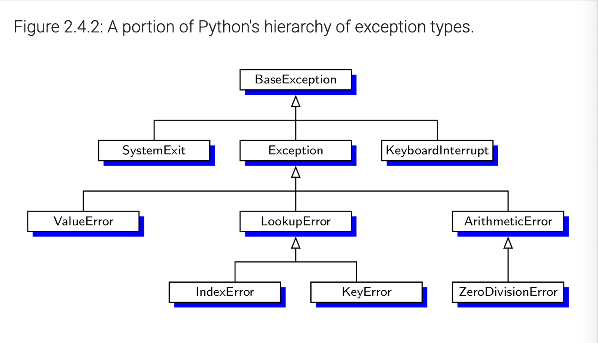
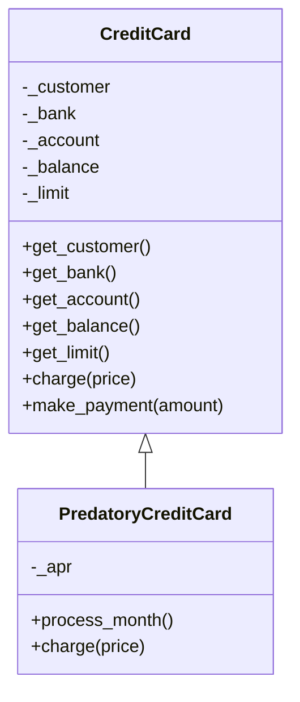
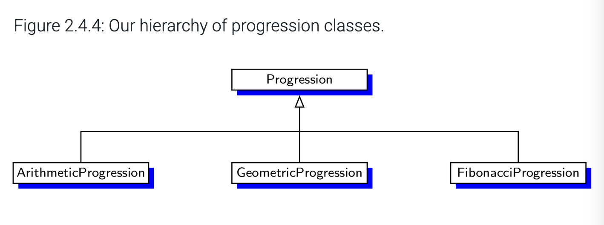
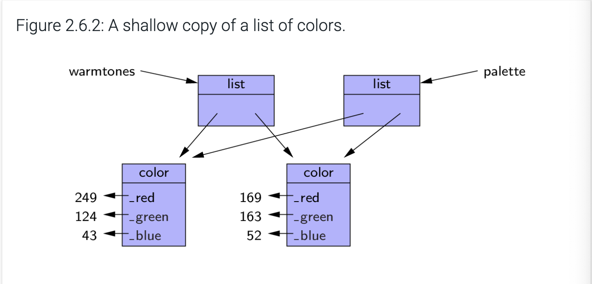
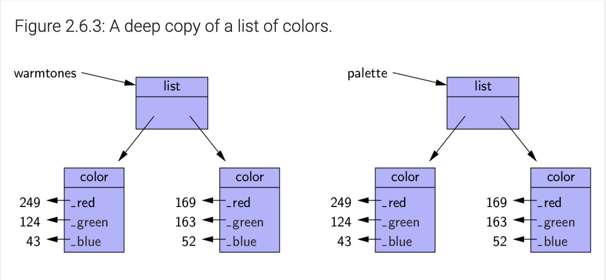

# Chapter 2: Object-Oriented Programming

### 2.1: Goals, principles, and patterns
- The main "actors" in object-oriented programming are **objects**. Every object is an **instance** of a **class**. Each class is a consistent view of the objects that are instances of the class. The class definition typically defines **instance variables**, sometimes called **data members**, for the object, as well as **methods** (sometimes called **member functions**) that the object can execute.
#### Object-oriented design goals
- Software implementations should aim to achieve robustness, adaptability, and reusability
##### Robustness
- In addition to the output of our software being "correct" in all circumstances, we want our program to be robust, which means capable of handling unexpected inputs and gracefully recovering from errors. This is particularly critical for software that can cause injuries or loss of life (think medical applications)
##### Adaptability
- Software needs to evolve over time to adjust to the conditions in its environment. This is adaptability (or evolvability), and it is related to portability, meaning the ability of software to run on different types of hardware, with minimal changes. Python provides significant portability
##### Reusability
- Along with adaptability, software should be reusable, meaning the same code can be used as a component for multiple different systems. However, this does not mean to simply copy/paste code from one project to another
#### Object-oriented design principles
- The chief principles of object-oriented design are **modularity**, **abstraction**, and **encapsulation**
##### Modularity
- Modern software systems often have multiple different components that interact, and these components must be well organized. **Modularity** refers to a principle of organizing components of a software system into separate functional units
- Modularity helps increase robustness, as we have individual, separate components, that can be more easily tested/debugged as they are integrated into larger systems. Additionally, if a bug shows up later in a component, it can more easily be fixed in isolation, without disturbing the rest of the system.
##### Abstraction
- Abstraction is meant to distill complicated systems down to their most fundamental parts. Describing parts of the system involves naming them and explaining their functionality. Applying abstraction paradigms to design of data structures gives rise to **abstract data types (ADTs)**. ADT is a mathematical model of a data structure that specifies type of data stored, the operations supported on them, and the types of parameters of the operations. It specifies what each operation does, but not how it does it. This can be referred to as a **public interface**.
- Python allows for great latitude in specifications of an interface and Python traditionally treats abstractions implicitly using **duck typing** ("if it walks like a duck and quacks like a duck, then it's a duck"). Formally, Python supports abstract data types using **abstract base classes (ABC)**, which cannot be instantiated (you cannot directly create an instance of that class), but it defines one or more common methods that all implementations of the abstraction must have. An ABC is realized by one or more **concrete classes**, which inherit from the abstract base class, while providing implementations for the methods declared in the ABC. Python supports this through the `abc` module and there are some existing ABCs coming from Python's `collections` module.
##### Encapsulation
- Components of a software system should not reveal the internal details of their respective implementations. It gives a programmer freedom to implement details, without having to worry that others are writing code depending on those specific implementation details. Encapsulation allows for implementation details to change without adversely affecting other parts of the program, making it easier to add functionality or fix bugs. Python provides only loose support for encapsulation, the convention is for data members and member functions that are non-public to be named starting with a single underscore
#### Design patterns
- In order to write effective object-oriented code, you need to understand and effectively use object-oriented design techniques. A **design pattern** describes a "typical" software design problem and provides a general template solution. Design patterns tend to fall into two groups, patterns for solving algorithm design problems and patterns for solving software engineering problems
- Algorithm design patterns
  - Recursion
  - Amortization
  - Divide-and-conquer
  - Prune-and-search, also known as decrease-and-conquer
  - Brute force
  - Dynamic programming
  - The greedy method
- Software engineering design patterns
  - Iterator
  - Adapter
  - Position
  - Composition
  - Template method
  - Locator
  - Factory method

### 2.2: Software development
- Traditional software development involves three major phases, design, implementation, and testing/debugging
#### Design
- The design phase is perhaps the most important phases of the process, where we decide how the workings of our program will be grouped into classes, how the classes will interact, what data they'll store, and what actions each will take. Some general rules of thumb that can be used when determining how to design classes
  - **Responsibilities**: divide work into different **actors**, each with a different responsibility, and describe the responsibilities using action verbs. These actors can become the classes for a program
  - **Independence**: define the work of each class as independent from other classes as possible, with each class having autonomy over some part of the program. Data should be allocated to the class (as instance variables) that has jurisdiction over the actions that require access to this data
  - **Behaviors**: define behaviors for each class carefully and precisely, these behaviors will define the methods each class performs. The set of methods for a class are its **interface** and are how other classes will interact
- Common tool for initial high-level design for a project is **Class-Responsibility-Collaborator (CRC)** cards, which are index cards that subdivide work of a program. Each card represents a component, which will ultimately become a class. Each card has the name of the component on top, the left-hand side has the written responsibilities of the component, on the right hand side, list the collaborators for the component (other components that this one will have to interact with). This goes through the action/actor cycle, where we identify actions, then determine an actor best suited for the action. 
- A standard approach to explain and document program design is **Unified Modeling Language (UML)**, which are standard visual notation to show the organization of object-oriented software design. There are a number of tools available for creating UML diagrams (such as draw.io), with one type of UML figure being a class diagram
- The class diagram below has three sections, the first with the name of the class, the second the recommended instance variables, and the third the recommended methods

#### Pseudocode
- A way to describe algorithms in human language is called **pseudocode**, which is not a computer program, but more like very structured prose. It is not meant for computer usage, but rather for reading by a human
#### Coding style and documentation
- Programs should be easy to read and understand, so programmers should be mindful of the coding style they use. A good start is to use [PEP 8](https://peps.python.org/pep-0008/). A few main principles are helpful
  - Use four spaces for indentation, avoid tabs
  - Use meaningful names for identifiers
    - Classes should have a name with a singular noun (`Date` vs `Dates`) and should be CamelCase
    - Functions should be lowercase, with words separated by underscores
    - Names that identify an individual object should be lowercase, separated by underscores
    - Identifiers for a constant should be all capital letters (ex. `MAX_SIZE`)
    - Identifiers meant for "internal" use should be prefixed with an underscore
  - Use comments that add meaning and explain ambiguous or confusing constructs
#### Documentation
- Python supports adding formal documentation directly into source code via a **docstring**. By convention, these are triple quoted strings
- Docstrings are stored as a field of a module, function, or class where they are defined, and can be accessed with `help(x)`
- A good, widely used standard for docstrings is the Numpy docstring [standard](https://numpydoc.readthedocs.io/en/latest/format.html)
#### Testing and Debugging
- Testing is the process of experimentally checking the correctness of a program, while debugging is tracking the execution of a program and finding errors in it. These are often quite time-consuming activities in the development of a program
##### Testing
- Careful testing plan is essential when writing a program and we should aim to execute a representative subset of inputs for our program, at a minimum testing each method at least once.
- Programs often fail on **special cases** (or edge cases/corner cases) of input, so these should be carefully identified and tested. What happens if an input is empty? What if a number is negative? etc. etc.
- If possible, one should try and run the program on a large assortment of randomly generated inputs, the `random` module can provide help in generating these inputs
- Two main testing strategies, *top-down* and *bottom-up* testing
  - **Top-down testing**: proceeds from top to bottom of program hierarchy, typically used in conjunction with **stubbing** where lower level components are replaced with a **stub**, which simulates that components functionality
  - **Bottom-up testing**: proceeds from lower-level components to higher-level components, with bottom-level components that do not have dependencies being tested first, then proceeding upward. This is often called **unit testing**, as specific components are tested in isolation from the larger program
- Python supports several forms of unit testing, such as through the `unittest` module (or use [`pytest`](https://docs.pytest.org/en/stable/)). As software is continually developed, these tests can be maintained, acting as **regression tests**, which help ensure that previously working functionality does not break
##### Debugging
- Simple debugging technique is to use print statements to inspect values at various points of execution, but can also use a debugger with the insertion of breakpoints in the code. This allows you to inspect the values of variables at different points in the program's execution.

### 2.3: Class definitions
- Classes are the primary means of abstraction in object-oriented programming, where every piece of data is an instance of a class. Classes have defined sets of behaviors in the form of **member functions** (or methods), which are common to all instances of that class. Classes are blueprints for each instance, with each instance having defined **attributes**
```python
# Example class definition
class CreditCard:
    """A consumer credit card."""
    
    def __init__(self, customer, bank, acnt, limit):
        """Create a new credit card instance.
    
        The initial balance is zero.
        
        Attributes
        ----------
        customer
            the name of the customer (e.g., 'John Bowman')
        bank
            the name of the bank (e.g., 'California Savings')
        acnt
            the account identifier (e.g., '5391 0375 9387 5309')
        limit
            credit limit (measured in dollars)
        """
        self._customer = customer
        self._bank = bank
        self._account = acnt
        self._limit = limit
        self._balance = 0
  
    def get_customer(self):
        """Return name of the customer."""
        return self._customer
      
    def get_bank(self):
        """Return the bank's name."""
        return self._bank
  
    def get_account(self):
        """Return the card's identifying number (typically stored as a string)."""
        return self._account
  
    def get_limit(self):
        """Return current credit limit."""
        return self._limit
  
    def get_balance(self):
        """Return current balance."""
        return self._balance

    def charge(self, price):
        """Charge the given price to the card, assuming sufficient credit limit.

        Return True if charge was processed; False if charge was denied.
        """
        if price + self._balance > self._limit:    # if charge would exceed limit,
            return False                           # cannot accept charge
        else:
            self._balance += price
            return True

    def make_payment(self, amount):
        """Process customer payment, which reduces balance."""
        self._balance -= amount


if __name__ == '__main__':
    primary_card = CreditCard('John Bowman', 'California Savings', '5391 0375 9387 5309', 2500)
    rewards_card = CreditCard('John Bowman', 'California Federal', '3485 0399 3395 1954', 3500)

    if primary_card.get_bank() != 'California Savings':
        print('Problem with recording of bank')
    if rewards_card.get_bank() != 'California Federal':
        print('Problem with recording of bank')

    if not rewards_card.charge(1000):
        print('Initial charge of $1000 should not be rejected')
    if rewards_card.get_balance() != 1000:
        print('Problem with balance')
    rewards_card.charge(2000)
    if rewards_card.get_balance() != 3000:
        print('Problem with balance')

    # try going over the credit limit
    if rewards_card.charge(1000):
        print('Charge should have been denied')
    if rewards_card.get_balance() != 3000:
        print('Failed charge should not have impacted balance')

    if primary_card.get_balance() != 0:
        print('Problem as primary card should still have zero balance.')
```
##### The `self` identifier
- The `self` identifier refers to the instance of the class upon which the method is invoked. `self` appears as the first formal parameter in the declaration of each method (unless it is a static method). Python automatically binds `self` with the instance of the class and `self` must be prefixed when accessing any *instance variables*
##### The constructor
- The `__init__` method is the **constructor** of the class (note the two underscores at the beginning and at the end). The constructor's main responsibility is to establish the newly created instance of the class with the appropriate instance variables
##### Encapsulation
- As a general rule, we can treat instance variables as nonpublic, which helps us enforce consistent state for all instances. We can provide accessors (such as `get_balance()`) or update methods to allow users to get or set instance variables
##### Error checking
- The example above does not include type checking or value checking, which leaves it very susceptible to incorrect data and consequently, it is not particularly robust
##### Testing the class
- Some basic tests can be defined for the class, as shown above, but they do not have wide coverage of all methods or statements. Further attention should be paid to testing this class
#### Operator overloading and Python's special methods
- Python's built-in classes provide semantics for many operators (ex. `a + b` which does addition for numeric types, but concatenation for strings). If we are defining a new class, we need to consider if that syntax should be defined explicitly
- You can provide a definition of this operator by using **operator overloading**, which, in this instance, is done by implementing a specially named method, `__add__`. 
##### Non-operator overloads
- In addition to traditional operator overloading, Python supports other specially named methods to control behaviors in specific situations. For example, what should your class do if someone calls `str(class)`? This can be defined through `class.__str__()` and similar methods are used for `int`, `float`, and `bool` conversions, along with other built-in functions like `len()` through the `class.__len__()` method
##### Implied methods
- Generally, if a particular special method is not implemented in a user-defined class, the standard syntax will raise an exception. However, some operators (such as `__bool__`) have default semantics so that every object other than `None` will return `True`

| Overloaded Operation Syntax | Special method form                                  |
|-----------------------------|------------------------------------------------------|
| a + b                       | a.__add__(b); alternatively, b.__radd__(a)           |
| a - b                       | a.__sub__(b); alternatively, b.__rsub__(a)           |
| a * b                       | a.__mul__(b); alternatively, b.__rmul__(a)           |
| a / b                       | a.__truediv__(b); alternatively, b.__rtruediv__(a)   |
| a // b                      | a.__floordiv__(b); alternatively, b.__rfloordiv__(a) |
| a % b                       | a.__mod__(b); alternatively, b.__rmod__(a)           |
| a ** b                      | a.__pow__(b); alternatively, b.__rpow__(a)           |
| a << b                      | a.__lshift__(b); alternatively, b.__rlshift__(a)     |
| a >> b                      | a.__rshift__(b); alternatively, b.__rrshift__(a)     |
| a & b                       | a.__and__(b); alternatively, b.__rand__(a)           |
| a ^ b                       | a.__xor__(b); alternatively, b.__rxor__(a)           |
| a \| b                      | a.__or__(b); alternatively, b.__ror__(a)             |
| a += b                      | a.__iadd__(b)                                        |
| a -= b                      | a.__isub__(b)                                        |
| a *= b                      | a.__imul__(b)                                        |
| ...                         | ...                                                  |
| +a                          | a.__pos__()                                          |
| -a                          | a.__neg__()                                          |
| ~a                          | a.__invert__()                                       |
| abs(a)                      | a.__abs__()                                          |
| a < b                       | a.__lt__(b)                                          |
| a <= b                      | a.__le__(b)                                          |
| a > b                       | a.__gt__(b)                                          |
| a >= b                      | a.__ge__(b)                                          |
| a == b                      | a.__eq__(b)                                          |
| a != b                      | a.__ne__(b)                                          |
| v in a                      | a.__contains__(v)                                    |
| a[k]                        | a.__getitem__(k)                                     |
| a[k] = v                    | a.__setitem__(k,v)                                   |
| del a[k]                    | a.__delitem__(k)                                     |
| a(arg1, arg2, ...)          | a.__call__(arg1, arg2, ...)                          |
| len(a)                      | a.__len__()                                          |
| hash(a)                     | a.__hash__()                                         |
| iter(a)                     | a.__iter__()                                         |
| next(a)                     | a.__next__()                                         |
| bool(a)                     | a.__bool__()                                         |
| float(a)                    | a.__float__()                                        |
| int(a)                      | a.__int__()                                          |
| repr(a)                     | a.__repr__()                                         |
| reversed(a)                 | a.__reversed__()                                     |
| str(a)                      | a.__str__()                                          |

#### Example: Multidimensional vector class
```python
class Vector:
    """Represent a vector in a multidimensional space."""
  
    def __init__(self, d):
        """Create d-dimensional vector of zeros."""
        self._coords = [0] * d
  
    def __len__(self):
        """Return the dimension of the vector."""
        return len(self._coords)
  
    def __getitem__(self, j):
        """Return jth coordinate of vector."""
        return self._coords[j]
  
    def __setitem__(self, j, val):
        """Set jth coordinate of vector to given value."""
        self._coords[j] = val
  
    def __add__(self, other):
        """Return sum of two vectors."""
        if len(self) != len(other):                   # relies on __len__ method
            raise ValueError('dimensions must agree')
        result = Vector(len(self))                    # start with vector of zeros
        for j in range(len(self)):
            result[j] = self[j] + other[j]
        return result
  
    def __eq__(self, other):
        """Return True if vector has same coordinates as other."""
        return self._coords == other._coords
  
    def __ne__(self, other):
        """Return True if vector differs from other."""
        return not self == other                      # rely on existing __eq__ definition
  
    def __str__(self):
        """Produce string representation of vector."""
        return '<' + str(self._coords)[1:-1] + '>'    # adapt list representation
```
#### Iterators
- An **iterator** for a collection supports a special method `__next__` which returns the next element of the collection, or raises `StopIteration` if there are no further elements
- One does not often directly implement iterators, but typically will implement a **generator**
- Python provides a default automatic iterator implementation for any class that defines both `__len__` and `__getitem__`
```python
class SequenceIterator:
    """An iterator for any of Python's sequence types."""
  
    def __init__(self, sequence):
        """Create an iterator for the given sequence."""
        self._seq = sequence            # keep a reference to the underlying data
        self._k = -1                    # will increment to 0 on first call to next
  
    def __next__(self):
        """Return the next element, or else raise StopIteration error."""
        self._k += 1                    # advance to next index
        if self._k < len(self._seq):
            return(self._seq[self._k])  # return the data element
        else:
            raise StopIteration()       # there are no more elements
  
    def __iter__(self):
        """By convention, an iterator must return itself as an iterator."""
        return self
```
#### Example: `OurRange` class
```python
class OurRange:
    """A class that mimic's the built-in range class."""
  
    def __init__(self, start, stop=None, step=1):
        """Initialize an OurRange instance.
    
        Semantics are similar to the built-in range class.
        """
        if step == 0:
            raise ValueError('step cannot be 0')
          
        if stop is None:                  # special case of OurRange(n)
            start, stop = 0, start        # should be treated as if OurRange(0,n)
    
        # calculate the effective length once
        self._length = max(0, (stop - start + step - step/abs(step)) // step)
    
        # need knowledge of start and step (but not stop) to support __getitem__
        self._start = start
        self._step = step
  
    def __len__(self):
        """Return number of entries in the range."""
        return self._length
  
    def __getitem__(self, k):
        """Return entry at index k (using standard interpretation if negative)."""
        if k < 0:
            k += len(self)                # attempt to convert negative index
    
        if not 0 <= k < self._length:
            raise IndexError('index out of range')
    
        return self._start + k * self._step
```

### 2.4: Inheritance
- Natural way to structure components of software is in a **hierarchical** manner, similar abstractions are grouped together in a way that goes from specific to more general
- 
- In the example shown, `House` is a subset of `Building` and is a superset of `Ranch`. Relationships between hierarchy levels are often referred to as **"is a" relationship** (ex. "house is a building", etc.)
- In software development, common functionality can be grouped at the most general level, in OOP, the mechanism of modular/hierarchical organization is called **inheritance**. New classes (commonly called **derived class**, **child class**, or **subclass**) can be defined based upon an existing class (commonly called **base class**, **parent class**, or **superclass**). When using inheritance, the subclass automatically includes all methods from the superclass and all fields (presuming the superclass constructor is called).
- Subclasses may differentiate/**specialize** existing behaviors by **overriding** (providing a new implementation) an existing method or **extend** the superclass by adding new methods
#### Python's exception hierarchy
- Another example of inheritance is with Exceptions in Python. A number of subclasses of `BaseException` have already been defined, though you can define your own exceptions as needed (should create them as a child class of `Exception`)
- 
#### Extending the `CreditCard` class

- In our example, the new subclass `PredatoryCreditCard` specializes its superclass by overriding the `charge()` method. A code example of this implementation is shown below. The mechanism for calling the inherited instructor is `super().__init__()`, which calls the constructor from the CreditCard superclass. We also use `super()` to call the `charge()` method from the `CreditCard` parent class, but we add additional logic to assess a penalty if the charge is not successful. The `process_month()` method does not inherit anything, therefore we define it as normal
```python
class PredatoryCreditCard(CreditCard):
    """An extension to CreditCard that compounds interest and penalties."""
    
    def __init__(self, customer, bank, acnt, limit, apr):
        """Create a new predatory credit card instance.
    
        The initial balance is zero.
    
        customer  the name of the customer (e.g., 'John Bowman')
        bank      the name of the bank (e.g., 'California Savings')
        acnt      the account identifier (e.g., '5391 0375 9387 5309')
        limit     credit limit (measured in dollars)
        apr       annual percentage rate (e.g., 0.0825 for 8.25% APR)
        """
        super().__init__(customer, bank, acnt, limit)  # call super constructor
        self._apr = apr
  
    def charge(self, price):
        """Charge given price to the card, assuming sufficient credit limit.
    
        Return True if charge was processed.
        Return False and assess $5 penalty if charge is denied.
        """
        success = super().charge(price)          # call inherited method
        if not success:
            self._balance += 5                   # assess penalty
        return success                           # caller expects return value
  
    def process_month(self):
        """Assess monthly interest on outstanding balance."""
        if self._balance > 0:
            # if positive balance, convert APR to monthly multiplicative factor
            monthly_factor = pow(1 + self._apr, 1/12)
            self._balance *= monthly_factor
```
##### Protected members
- In our subclass, we are accessing `self._balance`, which we have described as an attribute that is nonpublic. However, since we are creating a subclass, we can draw a distinction between **protected** and **private**. **Protected** members are available to the subclasses, but not the public, while a **private** member is not accessible to either. Of course, Python does not support formal access control, but a convention is to use one underscore for protected and two underscores for private. We have to be cautious in using these members though, as we have now created a dependency that may break if the CreditCard class is updated
#### Hierarchy of numeric progressions
- Another example of inheritance is a hierarchy of classes for iterating through numeric progressions. Our base class `Progression` is meant to provide as much common functionality as possible
- 
- The `Progression` class implements an *iterator*, specifically with `__next__` and `__iter__`
```python
class Progression:
    """Iterator producing a generic progression.
  
    Default iterator produces the whole numbers 0, 1, 2, ...
    """
  
    def __init__(self, start=0):
        """Initialize current to the first value of the progression."""
        self._current = start
  
    def _advance(self):
        """Update self._current to a new value.
    
        This should be overridden by a subclass to customize progression.
    
        By convention, if current is set to None, this designates the
        end of a finite progression.
        """
        self._current += 1
  
    def __next__(self):
        """Return the next element, or else raise StopIteration error."""
        if self._current is None:    # our convention to end a progression
            raise StopIteration()
        else:
            answer = self._current   # record current value to return
            self._advance()          # advance to prepare for next time
            return answer            # return the answer
  
    def __iter__(self):
        """By convention, an iterator must return itself as an iterator."""
        return self                  
  
    def print_progression(self, n):
        """Print next n values of the progression."""
        print(' '.join(str(next(self)) for j in range(n)))

class ArithmeticProgression(Progression):    # inherit from Progression
    """Iterator producing an arithmetic progression."""
    
    def __init__(self, increment=1, start=0):
        """Create a new arithmetic progression.
    
        increment  the fixed constant to add to each term (default 1)
        start      the first term of the progression (default 0)
        """
        super().__init__(start)              # initialize base class
        self._increment = increment
  
    def _advance(self):                      # override inherited version
        """Update current value by adding the fixed increment."""
        self._current += self._increment

class GeometricProgression(Progression):   # inherit from Progression
    """Iterator producing a geometric progression."""
    
    def __init__(self, base=2, start=1):
        """Create a new geometric progression.

        base       the fixed constant multiplied to each term (default 2)
        start      the first term of the progression (default 1)
        """
        super().__init__(start)
        self._base = base
  
    def _advance(self):                      # override inherited version
        """Update current value by multiplying it by the base value."""
        self._current *= self._base

class FibonacciProgression(Progression):
    """Iterator producing a generalized Fibonacci progression."""
    
    def __init__(self, first=0, second=1):
        """Create a new fibonacci progression.
    
        first      the first term of the progression (default 0)
        second     the second term of the progression (default 1)
        """
        super().__init__(first)              # start progression at first
        self._prev = second - first          # fictitious value preceding the first
  
    def _advance(self):
        """Update current value by taking sum of previous two."""
        self._prev, self._current = self._current, self._prev + self._current

if __name__ == '__main__':
    print('Default progression:')
    Progression().print_progression(10)
  
    print('Arithmetic progression with increment 5:')
    ArithmeticProgression(5).print_progression(10)
  
    print('Arithmetic progression with increment 5 and start 2:')
    ArithmeticProgression(5, 2).print_progression(10)
  
    print('Geometric progression with default base:')
    GeometricProgression().print_progression(10)
  
    print('Geometric progression with base 3:')
    GeometricProgression(3).print_progression(10)
  
    print('Fibonacci progression with default start values:')
    FibonacciProgression().print_progression(10)
    
    print('Fibonacci progression with start values 4 and 6:')
    FibonacciProgression(4,6).print_progression(10)
```
##### An arithmetic progression class
- An arithmetic progression adds a fixed constant to one term of the progression to produce the next. The `ArithmeticProgression` constructor (see above) calls the `super().__init__()` constructor and establishes an `_increment` attribute. We also override the `_advance()` method to appropriately increment our sequence.
##### A geometric progression class
- A geometric progression is one in which each value is produced by multiplying the previous value by a fixed constant (called the **base**). The starting point is typically 1. Similar to our `ArithmeticProgression` class, we call `super().__init__()` and set an attribute `_base`, along with overriding the `_advance()` method.
##### A Fibonnaci progression class
- A **Fibonnaci progression* is the sum of the two most recent values (ex. 0, 1, 1, 2, 3, 5, 8, ...). Our class introduces a new attribute `_prev` to store the value prior to the `_current` value. Our constructor expects the first and second values of the progression, with those we can set our `_prev` and `_current` values
#### Abstract base classes
- **Abstract base classes** can help avoid repetition of code, these base classes can be inherited by other classes, but cannot be directly instantiated. A class that can be instantiated is a **concrete class**. Python supports these abstract base classes through the `abc` module and the `collections.abc` module has multiple abstract base classes that can assist us in building custom data structures. These collections abstract base classes rely on a software design pattern called the **template method pattern**, which is when an abstract base class provides concrete behaviors that rely on calls to other abstract behaviors. Then when a subclass provides definitions for the missing abstract behaviors, the inherited concrete behaviors are well-defined.
- The `collections.abc.Sequence` ABC has behaviors common to `list`, `str`, and `tuple`, and also provides concrete implementations of methods `count`, `index`, and `__contains__`, as long as the inheriting class implements `__len__` and `__getitem__`
```python
from abc import ABCMeta, abstractmethod           # need these definitions

class Sequence(metaclass=ABCMeta):
    """Our own version of collections.abc.Sequence abstract base class."""
  
    @abstractmethod
    def __len__(self):
        """Return the length of the sequence."""
  
    @abstractmethod
    def __getitem__(self, j):
        """Return the element at index j of the sequence."""
  
    def __contains__(self, val):
        """Return True if val found in the sequence; False otherwise."""
        for j in range(len(self)):
            if self[j] == val:                    # found match
                return True
        return False
  
    def index(self, val):
        """Return leftmost index at which val is found (or raise ValueError)."""
        for j in range(len(self)):
            if self[j] == val:                    # leftmost match
                return j
        raise ValueError('value not in sequence') # never found a match
  
    def count(self, val):
        """Return the number of elements equal to given value."""
        k = 0
        for j in range(len(self)):
            if self[j] == val:                    # found a match
                k += 1
        return k
```
- In this code, we use the `ABCMeta` class from the `abc` module as a *metaclass* of `Sequence`, this `ABCMeta` declaration means the constructor for the class raises an error (specifically, you will get `TypeError: Can't instantiate abstract class Sequence without an implementation for abstract methods '__getitem__', '__len__'`). Additionally, the `@abstractmethod` decorator on `__len__` and `__getitem__` means we do not have an implementation for those methods, but we expect any subclass to provide one and Python will enforce this expectation.
- If a subclass provides its own implementation of an inherited behavior, the subclasses definition overrides the inherited one

### 2.5: Namespaces and object-orientation
- **Namespace** is an abstraction to manage all identifiers that are defined in a particular scope, and maps each identifier name to its value. Python treats functions/classes/modules as first-class objects, so they all have "value" (such as function/class/module) in the namespace
#### Instance and class namespaces
- An **instance namespace** manages the attributes specific to an individual object, such as the specific balance on an instance of the `CreditCard` class from before. The separate **class namespace** is specific to each class that has been defined and it is used to manage members that are shared by all instances of a class and is not specific to any particular instance. An example of this would be a class method such as `__init__` or `get_customer` etc. Note that the instance namespace includes all data members for the instance
##### How entries are established in a namespace
- When you use the `self` qualifier for an instance member (such as `self._balance`), the `_balance` identifier is added to the instance namespace. If you are using inheritance, there is still just a single instance namespace per object. The class namespace includes all declarations that are made within the body of the class definition. Member functions are the most typical entries in the class namespace, but other data values, or even other classes can be declared in the class namespace
##### Class data members
- A class level data member is often used when there is a value, such as a constant, that should be shared by all members of the class. In the example below, `OVERLIMIT_FEE` is a class-level member and is stored in the class namespace
```python
class PredatoryCreditCard(CreditCard):
    OVERLIMIT_FEE = 5                         # this is a class-level member
  
    def charge(self, price):
        success = super().charge(price)          
        if not success:
            self._balance += PredatoryCreditCard.OVERLIMIT_FEE
        return success
```
##### Nested classes
- It is possible to define a class definition within the scope of another class. In the example below, class `B` is in the namespace of class`A`. This structure can be used to indicate the nested class is meant to support the outer class and can help reduce name conflicts. We will use this structure when working with *linked lists* and *trees*. This can also allow for advanced inheritance, where a subclass of the outer class overrides the definition of the nested class (used in specializing nodes of a balanced search tree structure).
```python
class A: # the outer class
    class B: # the nested class
        ...
```
- Important to note that this is **not** inheritance on its own
##### Dictionaries and the `__slots__` declaration
- Python represents each namespace with a `dict` instance that maps names to objects. However, to use a more streamlined representation, you can use a class-level member named `__slots__` (example below). If a base class declares `__slots__`, the subclass must also declare `__slots__` and should only include the names of supplemental methods that are introduced 
```python
class CreditCard:
    __slots__ = '_customer', '_bank', '_account', '_balance', '_limit'

# not covered in the book, but can also use `dataclass` for a similar setup
from dataclasses import dataclass

@dataclass(slots=True)
class CreditCard:
    _customer: str
    _bank: str
    _account: str
    _balance: float
    _limit: int
```
#### Name resolution and dynamic dispatch
- When using the dot operator syntax (`obj.foo`) the Python interpreter uses the following name resolution process
  1. The instance namespace is searched
  2. The class namespace of the class to which the instance belows is searched
  3. The search continues upward in the inheritance hierarchy
  4. If the name is not found, an `AttributeError` is raised
- Python uses **dynamic dispatch** (or **dynamic binding**) to determine at run-time which implementation of function/method to call, based on the object it is invoked on. This is contrasted to **static dispatching** where the decision is made at compile-time

### 2.6: Shallow and deep copying
- As previously discussed, the statement `foo = bar` makes the name `foo` an **alias** of the object that is identified as `bar`. In some instances, we may want to make a copy of the object itself, rather than just make an alias
- To make a copy of a list, you can send a previous instance of a list to the `list` class constructor, for example `palette = list(warmtones)`. This will create what is known as a **shallow copy**.
- A **shallow copy** is a list where the contents are exactly the same as the original sequence, which means that both list objects would refer to the exact same objects as their elements. While this is better than an alias, it can lead to unexpected scenarios where we modify an object it one list only to see that change in the other list
- 
- A **deep copy** copies both the list itself and creates copies of the underlying objects
- 
#### Python's `copy` module
- To create a deep copy, the easiest method is to use Python's `copy` module, which has `copy.copy` and `copy.deepcopy` functions
- To create a deep copy, use the code `palette = copy.deepcopy(warmtones)`