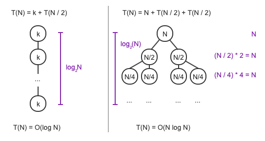

# Chapter 4: Searching and Algorithm Analysis

### 4.1: Searching and Algorithms
#### Algorithms
- **Algorithm** is a series of steps for solving a task, an example of an algorithm being a **linear search** algorithm. A linear search starts from the beginning of a list and checks every item in the list until the search key is found or the end of the list is reached.
```python
def linear_search(numbers, numbers_size, key):
    i = 0
    while i < numbers_size:
        if numbers[i] == key:
            return i
        i += 1
    return -1

numbers = [54, 79, 26, 91, 29, 33]
linear_search(numbers, len(numbers), 54)
linear_search(numbers, len(numbers), 82)
```
#### Algorithm runtime
- The runtime of an algorithm is the amount of time it takes to execute. If each comparison takes 1 microsecond, then a linear search algorithm for a list with 200 million items could take more than 3 minutes.
- Algorithms typically use a number of steps proportional to the size of the input. For the linear search algorithm, if there are 32 items in the list, the algorithm will require at most 32 comparisons, or for a list with `N` elements, linear search requires at most `N` comparisons. The algorithm is said to require "on the order" of `N` comparisons

### 4.2: Binary Search
#### Linear search vs. binary search
- Because linear search could require searching every element in a list, it can take a long time to run. If the list is sorted, however, a faster search, called **binary search** can be conducted. This algorithm checks the middle value first, if the desired value is lower, then the binary search searches the first half, otherwise the last half, with each step reducing the values that need to be searched by half
#### Binary search algorithm
- **Binary search** is a faster algorithm for searching a list, if the elements are sorted and are directly accessible (such as an array). This algorithm checks the middle element of the list, if the search key is found, the algorithm returns the matching location. If the search key is not found, the algorithm repeats the search on the left or right sublist (depending on if the search key was greater or less than the previously checked value).
```python
def binary_search(numbers, numbers_size, key):
    low = 0
    high = numbers_size - 1
    while high >= low:
        mid = int((high + low) / 2)
        if numbers[mid] < key:
            low = mid + 1
        elif numbers[mid] > key:
            high = mid - 1
        else:
            return mid
    return -1

numbers = [2, 4, 7, 10, 11, 32, 45, 87]
binary_search(numbers, len(numbers), 0)
binary_search(numbers, len(numbers), 10)
```
#### Binary search efficiency
- Binary search is very efficient for finding elements in sorted arrays, as it reduces the search space by about half in each step. For an `N` element array, the maximum number of steps required to reduce the search space to an empty subarray is $log_2N + 1$
- If each comparison takes 1 microsecond, then the binary search algorithm's runtime is at most 20 microseconds for a list with 1,000,000 elements, 21 microseconds for 2,000,000 element, 22 microseconds for 4,000,000 elements, etc. Using the example from before with 200,000,000 items, binary search requires less than 28 microseconds, which is up to 7,000,000 times faster than linear search

### 4.3: Python: Linear and binary search
#### Linear search
- Search algorithms are used to find the location of a particular key element from a list, or indicate that the key is not in the list. Linear search starts from the beginning of the list and checks every element, one at a time, until either the search key is found or the end of the list is reached. An example implementation is shown below
```python
def linear_search(numbers, key):
    for i in range(len(numbers)):
        if numbers[i] == key:
            return i
    return -1

linear_search([2, 4, 7, 10, 11, 32, 45, 87], 45)
linear_search([4, 7, 9, 11, 15, 18, 20, 22, 54], 55)
```
#### Binary search
- The binary search algorithm finds a location of a key value in a list, but is much faster than linear search, due to the operations it performs on a sorted list. Binary search compares the middle element of the list to the key, if the key matches, the number is returned and the algorithm is done. If the key is smaller, the loop proceeds to search the first half of the list, if the key is larger, the loop proceeds to search the last half of the list. The search field is always cut in half, which results in many fewer comparisons.
- To get the index of the middle of the low and high indices, the sum of the high and low indices is divided by two, if this result is not an integer, the result is rounded down to the nearest whole number using floor division, the operation can be written as `mid = (high + low) // 2`
```python
def binary_search(numbers, key):
    low = 0
    high = len(numbers) - 1
    while high >= low:
        mid = low + (high - low) // 2
        print(numbers[mid])
        if numbers[mid] == key:
            return mid
        elif numbers[mid] < key:
            low = mid + 1
        else:
            high = mid - 1
    return -1


binary_search([2, 4, 7, 10, 11, 32, 45, 87], 10)
binary_search([2, 4, 7, 10, 11, 32, 45, 87], 45)
```
### 4.4: Constant time operations
#### Constant time operations
- Designing efficient algorithms aims to lower the amount of time needed for the algorithm to run. However, faster processors run algorithms more quickly, so we describe algorithm runtime in terms of constant time operations, not units of time. A **constant time operation** is an operation that always operates in the same amount of time, regardless of the input values. 
  - Examples of constant time operations are assignment statements and multiplication, while operations like loops and string concatenations are examples of operations that are not constant time.
  - Keep in mind that multiple constant time operations taken together may be considered a constant time operation (a constant times a constant is still a constant)
  - Another thing to keep in mind is that certain hardware may execute division more slowly than multiplication
#### Identifying constant time operations
- The programming language, along with the hardware, can affect what is and is not a constant time operation. For example, most processors perform arithmetic operations as constant time operations, unaffected by operand values.

| Operation                                                                                           | Example                                                                                           |
|-----------------------------------------------------------------------------------------------------|---------------------------------------------------------------------------------------------------|
| Addition, subtraction, multiplication, and division of fixed size integer or floating point values. | <pre><code class="language-python">w = 10.4<br>x = 3.4<br>y = 2.0<br>z = (w - x) / y</code></pre> |
| Assignment of a reference, pointer, or other fixed size data value.                                 | <pre><code>x = 1000<br>y = x<br>a = True<br>b = a</code></pre>                                    |
| Comparison of two fixed size data values.                                                           | <pre><code>a = 100<br>b = 200<br>if (b > a):<br>    ...</code></pre>                              |
| Read or write an array element at a particular index.                                               | <pre><code>x = arr[index]<br>arr[index + 1] = x + 1</code></pre>                                  |

### 4.5: Growth of functions and complexity
#### Upper and lower bounds
- An algorithm with a runtime complexity of T(N) has an upper and lower bound
  - **Lower bound**: a function f(N) that is <= the best case T(N), for all values of N >= 1
  - **Upper bound**: a function f(N) that is >= the worst case T(N), for all values of N >= 1
- Given a function T(N), an infinite number of lower bounds and upper bounds exist. As an example, if an algorithm's best case runtime is `T(N) = 5N + 4`, then subtracting any nonnegative integer yields a lower bound: `5N + 3`, `5N + 2`, etc. To find the preferred bound, two additional criteria are commonly used. The preferred bound 1. is a single-term polynomial and 2. bounds T(N) as tightly as possible.
#### Growth rates and asymptotic notations
- We can use an additional simplification to factor out the constant from a bounding function, leaving a function that categorizes the algorithm's growth rate, so instead of saying an algorithm's runtime function has an upper bound of $30N^2$, the algorithm can be described as having a worst case growth rate of $N^2$
- **Asymptotic notation** is the classification of runtime complexity that uses functions that indicate only the growth rate of a bounding function
- There are three asymptotic notations commonly used in complexity analysis
  - **$O$ notation**: provides a growth rate for the algorithm's upper bound
  - **$\Omega$ notation**: provides a growth rate for the algorithm's lower bound.
  - **$\Theta$ notation**: provides a growth rate that is both an upper and lower bound.

| Notation | General form          | Meaning                                                                        |
|----------|-----------------------|--------------------------------------------------------------------------------|
| $O$      | $T(N) = O(f(N))$      | A positive constant $c$ exists such that, for all N ≥ 1, $T(N) \leq c * f(N)$. |
| $\Omega$ | $T(N) = \Omega(f(N))$ | A positive constant $c$ exists such that, for all N ≥ 1, $T(N) \geq c * f(N)$. |
| $\Theta$ | $T(N) = \Theta(f(N))$ | $T(N) = O(f(N))$ and $T(N) = \Omega(f(N))$.                                    |

### 4.6: O Notation
#### Big O notation
- **Big O notation** is a mathematical way of describing how a function (running time of an algorithm) generally behaves in relation to the input size. In Big O notation, all functions that have the same growth rate are characterized using the same Big O notation, so all functions that have the same growth rate are considered equivalent in Big O notation
- The Big O notation for a function can be determined using the following rules
  1. If f(N) is a sum of several terms, the highest order term (the one with the fastest growth rate) is kept and others are discarded
  2. If f(N) has a term that is a product of several factors, all constants (those that are not in terms of N) are omitted
#### Big O notation of composite functions
- The following rules are used to determine the Big O notation of composite functions, with c denoting a constant

| Composite function | Big O notation |
|--------------------|----------------|
| c · O(f(N))        | O(f(N))        |
| c + O(f(N))        | O(f(N))        |
| g(N) · O(f(N))     | O(g(N) · f(N)) |
| g(N) + O(f(N))     | O(g(N) + f(N)) |
#### Runtime growth rate
- When evaluating algorithms, the efficiency of the algorithm for large input sizes is critical. Small inputs are likely to have fast runtimes, so efficiency is less of a concern. The table below shows examples of the runtime required to perform f(N) instructions (assuming $1\mu s$ per instruction execution)

| Function   | N = 10 | N = 50     | N = 100       | N = 1000 | N = 10000  | N = 100000  |
|------------|--------|------------|---------------|----------|------------|-------------|
| $\log_2N$  | 3.3 μs | 5.65 μs    | 6.6 μs        | 9.9 μs   | 13.3 μs    | 16.6 μs     |
| $N$        | 10 μs  | 50 μs      | 100 μs        | 1000 μs  | 10 ms      | 100 ms      |
| $N\log_2N$ | .03 ms | .28 ms     | .66 ms        | .0099 s  | .132 s     | 1.66 s      |
| $N^2$      | .1 ms  | 2.5 ms     | 10 ms         | 1 s      | 100 s      | 2.7 hours   |
| $N^3$      | 1 ms   | .125 s     | 1 s           | 16.7 min | 11.57 days | 31.7 years  |
| $2^N$      | .001 s | 35.7 years | \> 1000 years |          |            |             |
#### Common Big O complexities
- Many commonly used algorithms have running time functions that belong to one of a handful of growth functions. The best algorithm is one that can be solved in constant time complexity (`O(1)`), but not all problems can be solved this way.

| Notation   | Name         | Example pseudocode                                                                                                                                                                                                                                                                                                                                                                                                         |
|------------|--------------|----------------------------------------------------------------------------------------------------------------------------------------------------------------------------------------------------------------------------------------------------------------------------------------------------------------------------------------------------------------------------------------------------------------------------|
| O(1)       | Constant     | <pre><code>find_min(x, y):<br>    if x < y:<br>        return x<br>    else:<br>        return y</code></pre>                                                                                                                                                                                                                                                                                                              |
| O(log N)   | Logarithmic  | <pre><code>binary_search(numbers, n, key):<br>    mid = 0<br>    low = 0<br>    high = n - 1<br><br>    while (high >= low):<br>        mid = (high + low) // 2<br>        if (numbers[mid] < key):<br>            low = mid + 1<br>        elif (numbers[mid] > key):<br>            high = mid - 1<br>        else:<br>            return mid<br>        <br>    return -1  # not found</code></pre>                     |
| O(N)       | Linear       | <pre><code>linear_search(numbers, numbers_size, key):<br>    for i in range(numbers_size):<br>        if (numbers[i] == key):<br>            return i<br>    <br>    return -1  # not found</code></pre>                                                                                                                                                                                                                   |
| O(N log N) | Linearithmic | <pre><code>merge_sort(numbers, l, r):<br>    if (l < r):<br>        j = (l + r) // 2        # Find midpoint<br><br>        merge_sort(numbers, l, j)      # Sort left part<br>        merge_sort(numbers, j + 1, r)  # Sort right part<br>        merge(numbers, l, j, r)      # Merge parts<br>    </code></pre>                                                                                                          |
| O(N²)      | Quadratic    | <pre><code>selection_sort(numbers, numbers_size):<br>    for i in range(numbers_size):<br>        index_smallest = i<br>        for j in range(i+1, numbers_size):<br>            if (numbers[j] < numbers[index_smallest]):<br>                index_smallest = j<br>        <br>        temp = numbers[i]<br>        numbers[i] = numbers[index_smallest]<br>        numbers[index_smallest] = temp<br>    </code></pre> |
| O(c^N)     | Exponential  | <pre><code>fibonacci(n):<br>    if ((n == 0) or (n == 1)):<br>        return n<br>    <br>    return fibonacci(n-1) + fibonacci(n-2)<br>    </code></pre>                                                                                                                                                                                                                                                                  |

### 4.7: Algorithm analysis
#### Worst-case algorithm analysis
- To analysis how algorithm runtime scales as input size increases, we need to determine how many operations an algorithm executes for an input size N, which is then used to determine big-O notation. Algorithm runtime analysis often focuses on the **worst-case runtime**, which is the runtime complexity that results in the longest execution (other runtimes include best-case runtime and average-case runtime).
#### Counting constant time operations
- When performing algorithm analysis, the definition of a single operation, which can be any statement (or constant number of statements) that has a constant runtime complexity, doesn't need to be precise since constants are omitted in big-O notation. This means you don't need to precisely count the number of constant time operations in a finite sequence

### 4.8: Recursive definitions
#### Recursive algorithms
- An algorithm is a sequence of steps, including at least 1 terminating step, for solving a problem. A **recursive algorithm** is an algorithm that breaks up the problem into smaller subproblems and then applies the algorithm itself to solve the smaller subproblems. Because a problem cannot be endlessly divided into smaller subproblems, a recursive algorithm must have a **base case**, where the algorithm completes without applying itself to a smaller subproblem.
#### Recursive functions
- A **recursive function** is a function that calls itself and a recursive function is commonly used to implement a recursive algorithm. Some example recursive functions are below
```python
def factorial(n: int) -> int:
    """
    Return the factorial of a given number, using recursion.
    
    Parameters
    ----------
    n : int
    
    Returns
    -------
    int
    
    Raises
    ------
    ValueError
        If the number provided is less than or equal to 0
    """
    if n <= 0:
        raise ValueError("n must be greater than 0")
    if n == 1:
        return 1
    else:
        return n * factorial(n - 1)

def cumulative_sum(n: int) -> int:
    """
    Calculate the cumulative sum of all integers, from 0 to n (inclusive).
    
    Parameters
    ----------
    n : int
    
    Returns
    -------
    int
    
    Raises
    ------
    ValueError
        If n is less than 0
    """
    if n < 0:
        raise ValueError("n must be non-negative")
    if n == 0:
        return 0
    else:
        return n + cumulative_sum(n - 1)
```
### 4.9: Recursive algorithms
#### Fibonacci numbers
- The **Fibonacci sequence** is a sequence where each number is the sum of the previous two items in the sequence, except for the first two, which are 0 and 1. An example implementation is shown below
```python
def fibonacci_number(terminating_index):
    if terminating_index == 0:
        return 0
    elif terminating_index == 1:
        return 1
    else:
        return fibonacci_number(terminating_index - 1) + fibonacci_number(terminating_index - 2)
```
#### Recursive binary search
- **Binary search** is an algorithm that searches a sorted list for a key by comparing the key to the middle element in the list and recursively searching half of the remaining list so long as the key is not found.
- The algorithm first checks the middle item of the list, if that is the search key, it is returned. Otherwise, the algorithm searches the left remaining sublist (if search key is less than the middle element) or the right remaining sublist (if search key is greater than the middle element)
```python
def binary_search(numbers, low, high, key):
    # Generally want to avoid recursive implementation of this algorithm..
    if low > high:
        return -1
    # This approach to calculating `mid` is preferred to avoid possible integer overflow errors
    # However, this is not something we would run into with Python
    mid = low + (high - low) // 2
    if numbers[mid] < key:
        return binary_search(numbers, mid + 1, high, key)
    elif numbers[mid] > key:
        return binary_search(numbers, low, mid - 1, key)
    return mid
```
### 4.10: Analyzing the time complexity of recursive algorithms
#### Recurrence relations
- A runtime complexity T(N) of a recursive function has function T on both sides of the equation. As an example, binary search performs constant time operations, then a recursive call that operates on half the input, which makes our runtime complexity `T(N) = O(1) + T(N/2)`. This function is known as a **recurrence relation**, which is a function that is defined in terms of the same function operation on a value < N.
- Using big-O notation for recursive functions requires solving the recurrence relation, for simple recursive functions, this can be done by expressing the number of function calls as a function of N. The number of function calls corresponds to the runtime complexity
#### Recursion trees
- Runtime complexity for any recursive function can be split into two parts: operations done directly by the function and operations done by the recursive calls made by the function. A useful tool for solving recurrences is a **recursion tree**, which is a visual diagram of an operation done by a recursive function, that separates operations done directly by the function and operations done by recursive calls.
- 