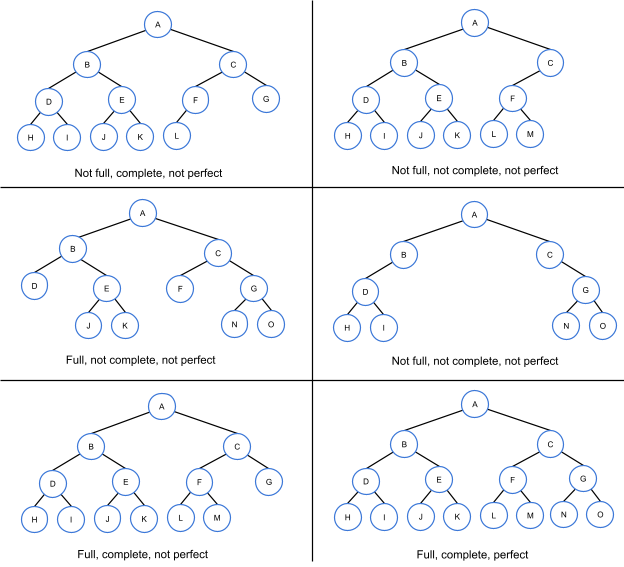
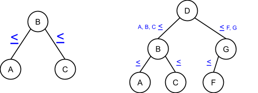

# Chapter 9: Trees

### 9.1: Binary Trees
#### Binary tree basics
- In a list, each node has a single successor, but in a **binary tree**, each node has up to two children, which are known as the *left child* and the *right child* (binary meaning two)
  - **Leaf**: a tree node with no children
  - **Internal node**: a node with at least one child
  - **Parent**: a node with a child is that child node's parent. A node's **ancestors** include the node's parent, parent's parent, etc., all the way to the tree root
  - **Root**: the one tree node with no parent ("top" node)
#### Depth, level, and height
- Additional binary tree terms
  - **Edge**: the link from a node to a child
  - **Depth**: the number of edges on  the path from the root to the node. The root node has a depth of 0
  - **Level**: all nodes with the same depth form a tree level
  - **Height**: the largest depth of a node in a tree. A tree with just one node has a height of 0
#### Special types of binary trees
- Certain binary tree structures affect the speed of operations on the tree
  - A binary tree is **full** if every node contains 0 or 2 children
  - A binary tree is **complete** if all levels, except potentially the last one, contain all possible nodes and all nodes in the last level are as far left as possible
  - A binary tree is **perfect** if all internal nodes have 2 children and all leaf nodes are at the same level
- 

### 9.2: Applications of trees
#### File systems
- Trees are commonly used to represent hierarchical data, such as file systems (since it is a hierarchy)
#### Binary space partitioning
- **Binary space partitioning (BSP)** is a technique of repeatedly separating a region of space into two parts and cataloging the objects within the regions. A **BSP tree** is a binary tree used to store information for a region in a binary space partition. Each node in a BSP tree contains information about a region of space and which objects are contained in the region.
- BSP trees can be used in graphics applications to store objects in a multidimensional world. The BSP tree can then be used to efficiently determine which objects to render on the screen, with the viewer's position used to perform a lookup in the BSP tree. The lookup quickly eliminates a large number of objects that are not visible/should not be rendered.
#### Using trees to store collections
- Most of the tree data structures store collections of values and there are a number of tree types to store data collections in ways that enable fast searching, inserting, and removing

### 9.3: Binary search trees
#### Binary search trees
- A **binary search tree (BST)** has an ordering property that any node's left subtree keys are less than or equal to the nodes key, and the right node's subtree keys are greater than or equal to the node key. This enables fast searching for items.
- 
#### Searching
- To **search** nodes means to find a node with a desired key, if it exists. The BST can give faster results than searching a list, and searches start at the root node. If a particular child node to be visited doesn't exist, then the desired node doesn't exist. In this way, only a small fraction of nodes need to be compared.
#### BST search runtime
- In the worst case, searching a BST requires H+1 comparisons (`O(H)` comparisons), where H is the tree height. A major BST benefit is that an N-node binary tree's height could be as small as $O(\log{N})$, which gives very fast searches. For example, a 10,000 item list may require 10,000 comparisons, but a 10,000 node BST may only require 14 comparisons.
- Binary tree heights can be optimized by keeping all levels full, except possibly the last level. The height of such as tree is $\lfloor\log_2{N}\rfloor$
#### Successors and predecessors
- A BST defines an order among nodes, from smallest to largest. A BST node's **successor** is the node that comes after in the BST ordering and the node's **predecessor** is the node that comes before in the BST ordering.
- If a node has a right subtree, the node's successor will be the right subtree's leftmost child. Starting from the right subtree's root, follow left children until reaching a node with no left child (this may be subtree's root itself). If the node doesn't have a right subtree, the node's successor is the first ancestor having this node in a left subtree

### 9.4: BST search algorithm
- Given a key, a **search** algorithm returns the first node found matching the key, or returns None if the matching node is not found. Simple BST search checks the current node (the tree's root), returning that node if it matches, otherwise assigning the current node to the left or right child node and repeating. If there is no child, the algorithm returns None.

### 9.5: BST insert algorithm
- Given a new node, the BST **insert** algorithm inserts the new node into its location following the BST ordering property. The algorithm starts by comparing the new node with the current node (initially the root)
  - *Insert as left child*: if the new node's key is less than the current node, and the current node's left child is null, the algorithm assigns that node's left child with the new node
  - *Insert as right child*: if the new node's key is greater than or equal to the current node, and the current node's right child is null, the algorithm assigns the node's right child with the new node
  - *Search for insert location*: If the left (or right) child is not null, the algorithm assigns the current node with that child and continues searching for a proper insert location
#### BST insert algorithm complexity
- One node is visited per level of the BST, so a BST with N nodes has at least $\log_2{N}$ levels and at most $N$ levels, meaning a best case runtime of $O(\log{N})$ and a worst case of $O(N)$. Space complexity is $O(1)$ because only a single pointer is used to traverse the tree to find the insert location

### 9.6: BST remove algorithm
- Given a key, a BST **remove** operation removes the first-found matching node and restructures the tree to preserve the BST ordering property. The algorithm first searches for a matching node (like the search algorithm). If found (node X), the algorithm performs one of the following sub-operations
  - *Remove leaf node*: If X has a parent (so X is not the root), the parent's left or right child (whichever points to X) is assigned with null. Else, if X was the root, the root pointer is assigned with null, and the BST is now empty
  - *Remove an internal node with single child*: If X has a parent node (so X is not the root), the parent's left or right child (whichever points to X) is assigned with X's single child. Else, if X was the root, the root pointer is assigned with X's single child
  - *Remove an internal node with two children*: First, the algorithm locates X's successor (leftmost child of X's right subtree), and copies the successor to X. Then the algorithm recursively removes the successor from the right subtree
#### BST remove algorithm complexity
- The BST remove algorithm traverses the tree from the root to find the node to remove. When the node being removed has two children, the node's successor is found and a recursive call is made. One node is visited per level, and in the worst case scenario, the tree is traversed twice from the root to the leaf. A BST with $N$ nodes has at least $\log_2{N}$ levels and at most $N$ levels. So removal's worst case time complexity is $O(\log{N})$ for a BST with $\log_2{N}$ levels and worst case $O(N)$ for a tree with $N$ levels
- Two pointers are used to traverse the tree during removal. When the node being removed has two children, a third pointer and copy of one node's data are also used, and one recursive call is made, giving a space complexity of $O(1)$

### 9.7: BST inorder traversal
- A **tree traversal** algorithm visits all nodes in the tree once and performs an operation on each node. An **inorder traversal** visits all nodes in a BST from smallest to largest, which is useful for printing the tree's nodes in sorted order. Starting from the root, the algorithm recursively prints the left subtree, the current node, and the right subtree

### 9.8: BST height and insertion order
#### BST height and insertion order
- A tree's **height** is the maximum edges from the root to any leaf (a one node tree has a height of 0)
- A *minimum* N-node binary tree height is $h = \lfloor\log_2{N}\rfloor$, which is when each level is full except possibly the last.
- A *maximum* N-node binary tree height is $N - 1$
- Searching a BST is fast when the tree's height is near its minimum
  - Inserting items in random order naturally keeps the BST's height near the minimum
  - Inserting items in nearly sorted order leads to a nearly maximum tree height
#### BSTGetHeight algorithm
- Given a node representing a BST subtree, the height can be computed as follows
  - If the node is null, return -1
  - Otherwise, recursively compute the left and right child subtree heights, and return 1 plus the greater of the 2 child subtree's heights

### 9.9: BST parent node pointers
- BST implementation often includes a parent pointer inside each node. A balanced BST, such as an AVL tree or red-black tree, may utilize the parent pointer to traverse up the tree from a particular node to find a node's parent, grandparent, or siblings.

### 9.10: BST - Recursion
#### BST recursive search algorithm
- BST search can be implemented recursively, where a single node and search key are passed as arguments to the recursive search function, which has two base cases. The first base case is when the node is null, in which call null is returned. If the node is non-null, then the search key is compared to the node key. The second base case is when the search key equals the node's key, in which case the node is returned. If the search key is less than the node's key, a recursive call is made on the node's left child, if the search key is greater than the node's key, a recursive call is made on the node's right child.
#### BST get parent algorithm
- A recursive BST get-parent algorithm searches for a parent in a same way as the normal BST search algorithm. But instead of comparing the search key with a candidate node's key, the search key is compared with the keys of the candidate node's children
#### Recursive BST insertion and removal
- BST insertion and removal can also be implemented using recursion. The insertion algorithm uses recursion to traverse down the tree until the insertion location is found. The removal algorithm uses the recursive search functions to find the node and the node's parent, then removes the node from the tree. If the node to remove is an internal node with 2 children, the node's successor is recursively removed.

### 9.11: Tries
#### Overview
- A **trie** (or **prefix tree**) is a tree representing a set of strings. Each non-root node represents a single character and each node has at most one child per distinct alphabet character. A **terminal node** is a node that represents a terminating character, which is at the end of a string in the trie.
- Tries provide efficient storage and quick search for strings, and are often used to implement auto-complete and predictive text input
#### Trie insert algorithm
- Given a string, a **trie insert** operation creates a path from the root to a terminal node that visits all the string's characters in sequence.
- A current node pointer initially points to the root. A loop then iterates through the string's characters.
- For each character "C"
  - A new child node is added only if the current node does not have a child for "C"
  - The current node pointer is assigned with the current node's child for "C"
- After all characters are processed, a terminal node is added and returned
#### Trie search algorithm
- Given a string, a **trie search** operation returns the terminal node corresponding to that string, or null if the string is not in the trie
#### Trie remove algorithm
- Given a string, a **trie remove** operation removes the string's corresponding terminal node and all non-root ancestors with 0 children
#### Trie time complexities
- Implementations commonly use a lookup table for a trie node's children, allowing retrieval of a child node from a character in $O(1)$ time. Therefore, to insert, remove, or search for a string of length M in a trie takes $O(M)$ time. The trie's current size does not affect each operation's time complexity.

### 9.12: Python - Binary search tree
- See [binarysearchtree.py](src/binarysearchtree.py) for implementation code
#### Constructing the node and binary search tree class
- A binary search tree can be implemented in Python using a Node class and a BinarySearchTree class. The Node class contains a key value and data members for the left and right children nodes. The BinarySearchTree contains a data member for the tree's root (a Node object)
#### Binary search tree search() method
- Binary search tree search algorithm first assigns `current_node` with the root. A loop is then entered, and one of three cases occurs:
  - Case 1: the current node's key matches the desired key, so `current_node` is returned from the method
  - Case 2: the desired key is less than the current node's key, so `current_node` is assigned with `current_node.left`
  - Case 3: the desired key is greater than the current node's key, so `current_node` is assigned with `current_node.right`
- The loop terminates once `current_node` is None, meaning the desired key is not in the tree
#### Binary search tree insert() method
- The insert() method is used to insert a new node into the tree. If the tree is empty, then the root data member is assigned with the new node. If the tree is not empty, `current_node` is assigned with the root node, and a loop is entered. Inside the loop, if the new node's key is less than the current node's key, then the new node is inserted as the current node's left child (if the current node has no left child), or current_node is assigned with current_node.left. If the new node's key is greater than or equal to the current node's key, then the new node is inserted as the current node's right child (if the current node has no right child), or current_node is assigned with current_node.right.
#### Binary search tree remove() method
- The remove() method has different actions depending on what kind of node is being removed
  - Case 1: The node being removed is a leaf. The parent's left or right data member is assigned with None, depending on which side the node is
  - Case 2: The node being removed has one child. The parent's left or right data member is assigned with the removed node's single child
  - Case 3: The node being removed has two children. The node's key is replaced by the successor's key, and then the successor (which falls under case 1 or case 2) is removed. The successor is the next largest node in the tree, and is always the right child's leftmost child