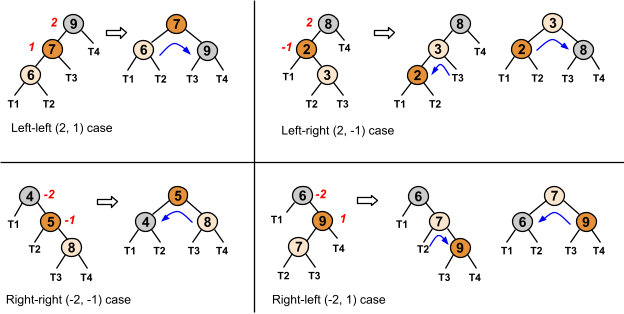

# Chapter 10: Balanced Trees

### 10.1: AVL - A balanced tree
#### Balanced BST
- An **AVL tree** is a BST with a height balance property and specific operations to re-balance the tree when a node is inserted or removed. A BST is **height balanced** if for any node, the heights of the node's left and right subtrees differ by only 0 or 1
- A node's **balance factor** is the left subtree height minus the right subtree height, which can be 1, 0, or -1 in an AVL tree
  - Note that you do not use the height of the tree itself, but only the subtrees
- A tree (or subtree) with just one node has a height of 0. For calculating balance factor, a non-existent left or right child's subtree's height is -1
#### AVL tree height
- Minimizing binary tree height gives you the fastest searches, insertions, and removals. If nodes are inserted/removed dynamically, maintaining minimum tree height requires extensive tree rearrangements, while an AVL tree requires only a few local rotations, which is more computationally efficient but doesn't guarantee a minimum height. An AVL tree's worst case height is about 1.5x the minimum binary tree height, so the height is still considered to be $O(\log{N})$, with N being the number of nodes. In practice, AVL tree heights are much closer to the minimum.
- 
- The height of a node in an AVL tree is the number of edges on the longest path from that given node to a leaf
  - A **leaf node** has a height of 0
  - An **empty node** has a height of -1
- 
  - 60's left subtree height is 0 (the height of node 50 is 0)
  - 60's right subtree height is 1 (the height of the tree beginning with 70 is 1)
  - 60's balance factor is -1 (left-subtree.height - right-subtree.height)
#### Storing height at each AVL node
- An AVL tree implementation can store the subtree height as a member of each node. With the height stored as a member of each node, the balance factor for any node can be computed in $O(1)$ time. This means that when nodes are inserted or removed from the AVL tree, ancestor nodes may need to recompute their heights.
#### References
- [AVL tree: Wikipedia](http://en.wikipedia.org/wiki/AVL_tree)

### 10.2: AVL Rotations
#### Tree rotation to keep balance
- Inserting items into an AVL tree may require rearranging the tree to maintain height balance. **Rotation** is a local arrangement of a BST that maintains the BST ordering property while rebalancing the tree
- Rotating is said to be done "at" a node and the rotation moves the entire subtree along with the node
- Rotation can be to the left or right, rotation in both directions is symmetrical
#### Algorithms supporting AVL trees
- The `AVLTreeUpdateHeight` algorithm updates a node's height value by taking the maximum of the child subtree heights and adding 1.
```python
def avl_tree_update_height(node):
    left_height = -1
    if node.left is not None:
        left_height = node.left.height
    right_height = -1
    if node.right is not None:
        right_height = node.right.height
    node_height = max(left_height, right_height) + 1
    return node_height
```
- The `AVLTreeSetChild` algorithm sets a node as the parent's left or right child, updates the child's parent pointer, and updates the parent node's height
```python
def avl_tree_set_child(parent, which_child, child):
    if which_child != "left" and which_child != "right":
        return False
    if which_child == "left":
        parent.left = child
    else:
        parent.right = child
    if child is not None:
        child.parent = parent
    avl_tree_update_height(parent)
    return True
```
- The `AVLTreeReplaceChild` algorithm replaces one of a node's existing child pointers with a new value, utilizing `AVLTreeSetChild` to perform the replacement
```python
def avl_tree_replace_child(parent, current_child, new_child):
    if parent.left == current_child:
        return avl_tree_set_child(parent, "left", new_child)
    elif parent.right == current_child:
        return avl_tree_set_child(parent, "right", new_child)
    return False
```
- The `AVLTreeGetBalance` algorithm computes a node's balance factor by subtracting the right subtree height from the left subtree height
```python
def avl_tree_get_balance(node):
    left_height = -1
    if node.left is not None:
        left_height = node.left.height
    right_height = -1
    if node.right is not None:
        right_height = node.right.height
    return left_height - right_height
```
#### Right rotation algorithm
- A right rotation algorithm is defined on a subtree root (node D), which must have a left child (node B). The algorithm reassigns pointers, assigning B's right child with D, and assigning D's left child with C (B's original right child, which may be null). If D's parent is non-null, then the parent's child D is replaced with B. Other tree parts stay with their parent nodes
```python
def avl_tree_rotate_right(tree, node):
    left_right_child = node.left.right
    if node.parent is not None:
        avl_tree_replace_child(node.parent, node, node.left)
    else:
        tree.root = node.left
        tree.root.parent = None
    avl_tree_set_child(node.left, "right", node)
    avl_tree_set_child(node, "left", left_right_child)
```
#### AVL tree rebalancing
- When an AVL tree node has a balance factor of 2 or -2 (which only occurs after insertion or removal), the node must be rebalanced via rotations. The `avl_tree_rebalance` algorithm updates the height value at a node, computes the balance factor, and rotates if the balance factor is 2 or -2
```python
def avl_tree_rebalance(tree, node):
    avl_tree_update_height(node)
    if avl_tree_get_balance(node) == -2:
        if avl_tree_get_balance(node.right) == 1:
            avl_tree_rotate_right(tree, node.right)
        return avl_tree_rotate_left(tree, node)
    elif avl_tree_get_balance(node) == 2:
        if avl_tree_get_balance(node.left) == -1:
            avl_tree_rotate_left(tree, node.left)
        return avl_tree_rotate_right(tree, node)
    return node
```

### 10.3: AVL insertions
#### Insertions requiring rotations to rebalance
- Inserting an item into an AVL tree may cause the tree to become unbalanced and a rotation can rebalance the tree
- Sometimes the imbalance is due to an insertion on the *inside* of a subtree, rather than on the *outside*. In these cases, a double rotation is needed
#### Four imbalance cases
- After inserting a node, nodes on the path from the new node to the root should be checked for a balance factor of 2 or -2. The first such node P triggers re-balancing. Four different cases exist, which are distinguishable by the balance factor of node P and one of P's children.
- The four cases are `left-left (2, 1)`, `left-right (2, -1)`, `right-right (-2, -1)`, and `right-left (-2, 1)`
- 
#### Insertion with rebalancing
- An AVL tree insertion involves searching for the insert location, inserting the new node, updating the balance factors, and re-balancing
- Balance factor updates are only needed on nodes ascending along the path from the inserted node up to the root (because no other node's balance could be affected). Each node's balance factor can be recomputed by determining left/right subtree heights, or for speed can be stored in each node and then incrementally updated: +1 if ascending from a left child, -1 if from a right child. If a balance factor update yields 2 or -2, the imbalance case is determined via that node's left (for 2) or right (for -2) child's balance factor, and the appropriate rotations performed.
#### AVL insertion algorithm
- Insertion starts with the standard VST insertion algorithm. After inserting a node, all ancestors of the inserted node, from the parent to the root, are re-balanced. A node is rebalanced by first computing the node's balance factor, the performing any necessary rotations if the balance factor is outside -1, 1
```python
def avl_tree_insert(tree, node):
    if tree.root is None:
        tree.root = node
        node.parent = None
        return
    cur = tree.root
    while cur is not None:
        if cur.left is None:
            if node.key < cur.key:
                cur.left = node
                node.parent = cur
                cur = None
            else:
                cur = cur.left
        else:
            if cur.right is None:
                cur.right = node
                node.parent = cur
                cur = None
            else:
                cur = cur.right
    node = node.parent
    while node is not None:
        avl_tree_rebalance(tree, node)
        node = node.parent
```
- The AVL insertion algorithm traverses the tree from the root to a leaf node to find the insertion point, then traverses back up to the root to re-balance. One node is visited per level and at most two rotations are needed for a single node. Each rotation is $O(1)$, so the runtime complexity of insertion of $O(\log{N})$. A fixed number of pointers are needed for the AVL insertion algorithm, so the space complexity is $O(1)$
#### References
- [AVL tree simulator](https://www.cs.usfca.edu/~galles/visualization/AVLtree.html)

### 10.4: AVL removals
#### Removing nodes in AVL trees
- Given a key, an AVL tree **remove** operation removes the first-found matching node, restructuring the tree to preserve all AVL tree requirements. Removal begins by removing the node using the standard BST removal algorithm. After removing a node, all ancestors of the removed node, from the nodes' parent up to the root, are rebalanced. A node is rebalanced by first computing the node's balance factor, then performing rotations if the balance factor is 2 or -2
#### AVL tree removal algorithm
- To remove a key, the AVL tree removal algorithm first locates the node containing the key using `bst_search`. If the node is found, `avl_tree_remove_node` is called to remove the node. Standard BST removal logic is used to remove the node from the tree. Then `avl_tree_rebalance` is called for all ancestors of the removed node, from the parent up to the root
```python
def avl_tree_rebalance(tree, node):
    avl_tree_update_height(node)
    if avl_tree_get_balance(node) == -2:
        if avl_tree_get_balance(node.right) == 1:
            avl_tree_rotate_right(tree, node.right)
        return avl_tree_rotate_left(tree_node)
    elif avl_tree_get_balance(node) == 2:
        if avl_tree_get_balance(node.left) == -1
            avl_tree_rotate_left(tree, node.left)
        return avl_tree_rotate_right(tree, node)
    return node

def avl_tree_remove_key(tree, key):
    node = bst_search(tree, key)
    return avl_tree_remove_node(tree, node)

def avl_tree_remove_node(tree, node):
    if node is None:
        return False
    # Parent needed for rebalancing
    parent = node.parent
    # Case 1: Internal node with 2 children
    if node.left is not None and node.right is not None:
        successor_node = node.right
        while successor_node.left is not None:
            successor_node = successor_node.left
        node.key = successor_node.key
        avl_tree_remove_node(tree, successor_node)
        return True
    # Case 2: Root node (with 1 or 0 children)
    elif node == tree.root:
        if node.left is not None:
            tree.root = node.left
        else:
            tree.root = node.right
        if tree.root is not None:
            tree.root.parent = None
        return True
    # Case 3: Internal with left child only
    elif node.left is not None:
        avl_tree_replace_child(parent, node, node.left)
    # Case 4: Internal with right child only or left
    else:
        avl_tree_replace_child(parent, node, node.right)
    # Node is gone, anything that was below node that has persisted
    # is already correctly balanced, but ancestors may need rebalancing
    node = parent
    while node is not None:
        avl_tree_rebalance(tree, node)
        node = node.parent
    return True
```
#### AVL removal algorithm complexity
- In the worst case, the AVL removal algorithm traverses the tree to the lowest level to find the node to remove, then traverses back up to the root to rebalance. One node is visited per level, and at most 2 rotations are needed for a single node. Each rotation is an $O(1)$ operation, so the runtime complexity of AVL tree removal is $O(\log{N})$

### 10.5: Python - AVL trees
#### The node class for AVL trees
- Because AVL trees are a form of a binary search tree, the AVLTree class is similar to the BinarySearchTree class. A Node class is used to contain attributes `key`, `left`, and `right`, (like BinarySearchTree) and `parent` (pointer to parent node, None for root) and `height` (height of the subtree at the node, single node has a height of 0)
- `height` is used to detect imbalances in the tree after removals and insertions, while `parent` is used during rotations to correct imbalances
- `Node` class methods for AVL operations
  - `get_balance()`: return the node's balance factor, left child's height minus the right child's height. A height of -1 is used if the child is None
  - `update_height()`: calculate the node's current height and assign the height data member with the new value
  - `set_child()`: assigns either the left or right child data members with a new node
  - `replace_child()`: replace the current child node with a new node
#### Rotations and rebalancing
- Tree rotations are required to correct any problems where left and right subtrees of a node have heights that differ by more than one. After a new node is inserted into an AVL tree, either one or two rotations will fix any imbalance that happens (`rotate_left()` and `rotate_right()`). The `rebalance()` method examines the subtree of a node and determines what rotations to do if a height imbalance exists at the node.
#### Insertions
- AVL insertions require two steps
  1. Insert into the tree using the normal binary search tree insertion algorithm
     - This requires $O(\log{N})$ steps, since an AVL tree has $O(\log{N})$ levels, and the loop makes the current node go down one level with each iteration.
  2. Call `rebalance()` on all nodes along a path from the new node's parent up to the root
     - This requires $O(\log{N})$ steps, since the path back up to the root has $O(\log{N})$ levels to visit, and rotations are $O(1)$. This makes insert's worst-case runtime $O(\log{N})$
#### Removals
- Removal from an AVL tree is a two-step process, similar to insertion
  1. Remove the node in the same was as a BST, with one of four cases determining how to remove the node. Generally, the node's key is replaced by the successor node's key in the tree, and the successor is then more easily removed
  2. Call `rebalance()` on all nodes on the path from the removed node's parent up to the root. If the node's successor was ultimately removed, the rebalancing begins from the successor's parent, not the original target node.
- As with insertion, each step requires $O(1)$ operations to be performed, first on a path from the root down to a leaf, then on a path near a leaf back up to the root. Because the height of an AVL tree is $\log{N}$ levels, the entire removal algorithm has a worst case $O(\log{N})$ time
- Often a user does not know where a desired node to be removed is in the tree, or if the node even exists at all. You can use `remove_key()` to search for the node and then call `remove_node()` only if `search()` returns a node pointer

### 10.6: Red-black tree - a balanced tree
- A **red-black** tree is a BST with two node types (red and black), and supporting operations that ensure the tree is balanced when a node is inserted or removed. Red-black tree's requirements ensure that a tree with N nodes will have a height of $O(\log{N})$
  - Every node is colored either red or black
  - The root node is black
  - A red node's children cannot be red
  - A null child is considered to be a black leaf node
  - All paths from a node to any null leaf descendant node must have the same number of black nodes

### 10.7: Red-black tree - Rotations
#### Introduction to rotations
- A rotation is a rearrangement of a BST to maintain the BST ordering property while rebalancing the tree. These rotations are used during insert/remove operations on red/black trees to ensure that the red/black tree requirements hold and rotations are done "at" a node level
- A left rotation at a node causes the node's right child to take the node's place in the tree. A right rotation at a node causes the node's left child to take the node's place in the tree
#### Left rotation algorithm
- A rotation requires altering up to three child subtree pointers and requires the node's right child to be non-null.
- Two utility functions are used for red-black tree rotations
  - `rb_tree_set_child()` utility function sets a node's left child, if the `which_child` parameter is "left" or right child (if the `which_child` parameter is "right") and updates the child's parent pointer.
    ```python
    def rb_tree_set_child(parent, which_child, child):
        if which_child != "left" and which_child != "right":
            return False
        if which_child == "left":
            parent.left = child
        else:
            parent.right = child
        if child is not None:
            child.parent = parent
        return True
    ```
  - `rb_tree_replace_child()` utility function replaces a node's left or right child pointer with a new value
    ```python
    def rb_tree_replace_child(parent, current_child, new_child):
        if parent.left == current_child:
            return rb_tree_set_child(parent, "left", new_child)
        elif parent.right == current_child:
            return rb_tree_set_child(parent, "right", new_child)
        return False
    ```
- The `rb_tree_rotate_left()` function performs a left rotation at the specified node by updating the right child's left child to point to the node, then updating the node's right child to point to the right child's former left child. If non-null, the node's parent has the child pointer changed from node to the node's right child. Otherwise, if the node's parent is null, then the tree's root pointer is updated to point to the node's right child
    ```python
    def rb_tree_rotate_left(tree, node):
        right_left_child = node.right.left
        if node.parent is not None:
            rb_tree_replace_child(node.parent, node, node.right)
        else:
            tree.root = node.right
            tree.root.parent = None
        rb_tree_set_child(node.right, "left", node)
        rb_tree_set_child(node, "right", right_left_child)
    ```
#### Right rotation algorithm
- Right rotation is analogous to left rotation. A right rotation at a node requires the node's left child to be non-null
    ```python
    def rb_tree_rotate_right(tree, node):
        left_right_child = node.left.right
        if node.parent is not None:
            rb_tree_replace_child(node.parent, node, node.left)
        else:
            tree.root = node.left
            tree.root.parent = None
        rb_tree_set_child(node.left, "right", node)
        rb_tree_set_child(node, "left", left_right_child)
    ```
##### Python
```python
def rb_tree_set_child(parent, which_child, child):
    if which_child != "left" and which_child != "right":
        return False
    if which_child == "left":
        parent.left = child
    else:
        parent.right = child
    if child is not None:
        child.parent = parent
    return True

def rb_tree_replace_child(parent, current_child, new_child):
    if parent.left == current_child:
        return rb_tree_set_child(parent, "left", new_child)
    elif parent.right == current_child:
        return rb_tree_set_child(parent, "right", new_child)
    return False


def rb_tree_rotate_left(tree, node):
    right_left_child = node.right.left
    if node.parent is not None:
        rb_tree_replace_child(node.parent, node, node.right)
    else:
        tree.root = node.right
        tree.root.parent = None
    rb_tree_set_child(node.right, "left", node)
    rb_tree_set_child(node, "right", right_left_child)

def rb_tree_rotate_right(tree, node):
    left_right_child = node.left.right
    if node.parent is not None:
        rb_tree_replace_child(node.parent, node, node.left)
    else:
        tree.root = node.left
        tree.root.parent = None
    rb_tree_set_child(node.left, "right", node)
    rb_tree_set_child(node, "left", left_right_child)
```

### 10.8: Red-black tree - Insertion
- Given a new node, a red-black tree **insert** operation inserts the new node in a proper location to maintain all the red-black tree requirements.
- This process begins by calling `bst_insert()` to insert a node following BST insertion rules. The newly inserted node is colored red and then a balance operation is performed on the node
```python
def rb_tree_insert(tree, node):
    bst_insert(tree, node)
    node.color = "red"
    rb_tree_balance(tree, node)
```
- The red-black balance operation follows the steps
  1. Assign `parent` with `node`'s parent, `uncle` with `node`'s uncle (sibling of `parent`), and `grandparent` with `node`'s grandparent
  2. If `node` is the tree's root, then color `node` black and return
  3. If `parent` is black, then return without any alterations
  4. If `parent` and `uncle` are both red, then color `parent` and `uncle` black, color `grandparent` red, recursively rebalance `grandparent`, then return
  5. If `node` is `parent`'s right child and `parent` is `grandparent`'s left child, then rotate left at `parent`, assign `node` with `parent`, assign `parent` with `node`'s parent, and go to step 7
  6. if `node` is `parent`'s left child and `parent` is `grandparent`'s right child, then rotate right at `parent`, assign `node` with `parent`, assign `parent` with `node`'s parent, and go to step 7
  7. Color `parent` black and `grandparent` red
  8. If `node` is `parent`'s left child, then rotate right at `grandparent`, otherwise rotate left at `grandparent`
```python
def rb_tree_get_grandparent(node):
    if node.parent is None:
        return None
    return node.parent.parent

def rb_tree_get_uncle(node):
    grandparent = None
    if node.parent is not None:
        grandparent = rb_tree_get_grandparent(node)
    if grandparent is None:
        return None
    if grandparent.left == node.parent:
        return grandparent.right
```

### 10.9: Red-black tree - Removal
#### Removal overview
- Given a particular key, a red-black tree **remove** operation removes the first-found matching node, then restructuring the tree to preserve all red-black tree requirements. First, the node to remove is found using BST search. If found, `rb_tree_remove_node()` is called to remove the node
```python
def rb_tree_remove(tree, key):
    node = bst_search(tree, key)
    if node is not None:
        rb_tree_remove_node(tree, node)
```
- Given a key, a red-black tree **remove-key** operation removes the key from the tree (if present), then restructuring as needed to preserve all red-black tree requirements. This first calls `bst_search()` to find the node with a particular key, then, if found, calling `rb_tree_remove_node()` to remove the node
  1. If the node has two children, copy the key from the node's predecessor to a temporary value, recursively remove the predecessor from the tree, replace the node's key with the temporary value, and return
  2. If the node is black, call `rb_tree_prepare_for_removal()` to restructure the tree in preparation for the node's removal
  3. Remove the node using the standard BST removal algorithm
#### Removal utility functions
- Utility functions are used to simplify common operations of red-black tree removal code, such as `rb_tree_get_sibling` to get a sibling of a given node, `rb_tree_is_non_null_and_red()`, which returns true only if a node is non-null and red (otherwise False), `rb_tree_is_null_or_black()`, which returns true if a node is null or black, and `rb_tree_are_both_children_black()`, which returns true only if both of the node's children are black (remembering that null nodes are black)
#### Prepare-for-removal algorithm overview
- Preparation for removing a black node requires altering the number of black nodes along paths to preserve the black-path-length property. `rb_tree_prepare_for_removal()` uses six utility functions to analyze the tree and make appropriate alterations
#### Prepare for removal algorithm cases
- Preparation for removal first checks each of the following six use cases
  1. If the node is red or the node's parent is null, then return
  2. If the node has a red sibling, then color the parent red and the sibling black. If the node is the parent's left child then rotate left at the parent, otherwise rotate right at the parent. Continue to the next step.
  3. If the node's parent is black and both children of the node's sibling are black, then color the sibling red, recursively call on the node's parent, and return
  4. If the node's parent is red and both children of the node's sibling are black, then color the parent black, color the sibling red, then return
  5. If the sibling's left child is red and both children of the node's sibling are black, then color the parent black, color the sibling red, then return
  6. If the sibling's left child is black, the sibling's right child is red, and the node is the right child of the parent, then color the sibling red and the right child of the sibling black. Then rotate left at the sibling and continue to the next step.
  7. Color the sibling the same color as the parent and color the parent black
  8. If the node is the parent's left child, then color the sibling's right child black and rotate left at the parent. Otherwise, color the sibling's left child black and rotate right at the parent

| Case # | Condition                            | Action if condition is true | Process additional cases after action? |
|--------|--------------------------------------|-----------------------------|----------------------------------------|
| 1      | Node is red or node's parent is null | None                        | No                                     |
| 2 | Sibling node is red | Color parent red and sibling black. If node is left child of parent, rotate left at parent node, otherwise rotate right at parent node | Yes |
| 3 | Parent is black and both of sibling's children are black | Color sibling red and call removal preparation function on parent | No |
| 4 | Parent is red and both of sibling's children are black | Color parent black and sibling red | No |
| 5 | Sibling's left child is red, sibling's right child is black, and node is left child of parent | Color sibling red and sibling's left child black. Rotate right at sibling | Yes |
| 6 | Sibling's left child is black, sibling's right child is red, and node is red child of parent | Color sibling red and sibling's right child black. Rotate left at sibling | Yes |

##### Python
```python

def rb_tree_remove(tree, key):
    node = bst_search(tree, key)
    if node is not None:
        rb_tree_remove_node(tree, node)

def rb_tree_remove_node(tree, node):
    if node.left is not None and node.right is not None:
        predecessor_node = rb_tree_get_predecessor(node)
        predecessor_key = predecessor_node.key
        rb_tree_remove_node(tree, predecessor_node)
        node.key = predecessor_key
        return
    if node.color == "black":
        rb_tree_prepare_for_removal(node)
    bst_remove(tree, node.key)

def rb_tree_get_predecessor(node):
    node = node.left
    while node.right is not None:
        node = node.right
    return node

def rb_tree_get_sibling(node):
    if node.parent is not None:
        if node == node.parent.left:
            return node.parent_right
        return node.parent.left
    return None

def rb_tree_is_null_or_black(node):
    if node is None:
        return True
    return node.color == "black"

def rb_tree_are_both_children_black(node):
    if node.left is not None and node.left.color == "red":
        return False
    if node.right is not None and node.right.color == "red":
        return False
    return True

def rb_tree_prepare_for_removal(tree, node):
    
```

### 10.10: Python - Red-black trees
#### The RBTNode class for red-black trees
- The actual RedBlackTree class is similar to the BinarySearchTree class (RBTs are a form of BSTs)
- The RBTNode class contains data members `key`, `left`, and `right`, along with new attributes
  - `parent`: a pointer to the parent node, or None for root
  - `color`: a string representing the node's color, set to either "red" or "black"
- Additional class methods are below

| Method name | Description |
|-------------|-------------|
| `are_both_children_black()` | Returns True if both child nodes are black. A child set to None is considered to be black, as per the red-black tree requirements |
| `count()` | Returns the number of nodes in this subtree, including the node itself