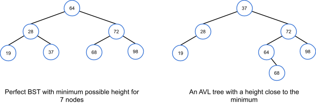

# Chapter 10: Balanced Trees

### 10.1: AVL - A balanced tree
#### Balanced BST
- An **AVL tree** is a BST with a height balance property and specific operations to re-balance the tree when a node is inserted or removed. A BST is **height balanced** if for any node, the heights of the node's left and right subtrees differ by only 0 or 1
- A node's **balance factor** is the left subtree height minus the right subtree height, which can be 1, 0, or -1 in an AVL tree
- A tree (or subtree) with just one node has a height of 0. For calculating balance factor, a non-existent left or right child's subtree's height is -1
#### AVL tree height
- Minimizing binary tree height gives you the fastest searches, insertions, and removals. If nodes are inserted/removed dynamically, maintaining minimum tree height requires extensive tree rearrangements, while an AVL tree requires only a few local rotations, which is more computationally efficient but doesn't guarantee a minimum height. An AVL tree's worst case height is about 1.5x the minimum binary tree height, so the height is still considered to be $O(\log{N})$, with N being the number of nodes. In practice, AVL tree heights are much closer to the minimum.
- 
#### Storing height at each AVL node
- An AVL tree implementation can store the subtree height as a member of each node. With the height stored as a member of each node, the balance factor for any node can be computed in $O(1)$ time. This means that when nodes are inserted or removed from the AVL tree, ancestor nodes may need to recompute their heights.
#### References
- [AVL tree: Wikipedia](http://en.wikipedia.org/wiki/AVL_tree)

### 10.2: AVL Rotations
#### Tree rotation to keep balance
- Inserting items into an AVL tree may require rearranging the tree to maintain height balance. **Rotation** is a local arrangement of a BST that maintains the BST ordering property while rebalancing the tree
- Rotating is said to be done "at" a node and the rotation moves the entire subtree along with the node
- Rotation can be to the left or right, rotation in both directions is symmetrical
#### Algorithms supporting AVL trees
- The `AVLTreeUpdateHeight` algorithm updates a node's height value by taking the maximum of the child subtree heights and adding 1.
```python
def avl_tree_update_height(node):
    left_height = -1
    if node.left is not None:
        left_height = node.left.height
    right_height = -1
    if node.right is not None:
        right_height = node.right.height
    node_height = max(left_height, right_height) + 1
    return node_height
```
- The `AVLTreeSetChild` algorithm sets a node as the parent's left or right child, updates the child's parent pointer, and updates the parent node's height
```python
def avl_tree_set_child(parent, which_child, child):
    if which_child != "left" and which_child != "right":
        return False
    if which_child == "left":
        parent.left = child
    else:
        parent.right = child
    if child is not None:
        child.parent = parent
    avl_tree_update_height(parent)
    return True
```
- The `AVLTreeReplaceChild` algorithm replaces one of a node's existing child pointers with a new value, utilizing `AVLTreeSetChild` to perform the replacement
```python
def avl_tree_replace_child(parent, current_child, new_child):
    if parent.left == current_child:
        return avl_tree_set_child(parent, "left", new_child)
    elif parent.right == current_child:
        return avl_tree_set_child(parent, "right", new_child)
    return False
```
- The `AVLTreeGetBalance` algorithm computes a node's balance factor by subtracting the right subtree height from the left subtree height
```python
def avl_tree_get_balance(node):
    left_height = -1
    if node.left is not None:
        left_height = node.left.height
    right_height = -1
    if node.right is not None:
        right_height = node.right.height
    return left_height - right_height
```
#### Right rotation algorithm
- A right rotation algorithm is defined on a subtree root (node D), which must have a left child (node B). The algorithm reassigns pointers, assigning B's right child with D, and assigning D's left child with C (B's original right child, which may be null). If D's parent is non-null, then the parent's child D is replaced with B. Other tree parts stay with their parent nodes
```python
def avl_tree_rotate_right(tree, node):
    left_right_child = node.left.right
    if node.parent is not None:
        avl_tree_replace_child(node.parent, node, node.left)
    else:
        tree.root = node.left
        tree.root.parent = None
    avl_tree_set_child(node.left, "right", node)
    avl_tree_set_child(node, "left", left_right_child)
```
#### AVL tree rebalancing
- When an AVL tree node has a balance factor of 2 or -2 (which only occurs after insertion or removal), the node must be rebalanced via rotations. The `avl_tree_rebalance` algorithm updates the height value at a node, computes the balance factor, and rotates if the balance factor is 2 or -2
```python
def avl_tree_rebalance(tree, node):
    avl_tree_update_height(node)
    if avl_tree_get_balance(node) == -2:
        if avl_tree_get_balance(node.right) == 1:
            avl_tree_rotate_right(tree, node.right)
        return avl_tree_rotate_left(tree, node)
    elif avl_tree_get_balance(node) == 2:
        if avl_tree_get_balance(node.left) == -1:
            avl_tree_rotate_left(tree, node.left)
        return avl_tree_rotate_right(tree, node)
    return node
```

### 10.3: AVL insertions
#### Insertions requiring rotations to rebalance
- Inserting an item into an AVL tree may cause the tree to become unbalanced and a rotation can rebalance the tree
- Sometimes the imbalance is due to an insertion on the *inside* of a subtree, rather than on the *outside*. In these cases, a double rotation is needed
#### Four imbalance cases
- After inserting a node, nodes on the path from the new node to the root should be checked for a balance factor of 2 or -2. The first such node P triggers re-balancing. Four different cases exist, which are distinguishable by the balance factor of node P and one of P's children.
- The four cases are `left-left (2, 1)`, `left-right (2, -1)`, `right-right (-2, -1)`, and `right-left (-2, 1)`
- 
#### Insertion with rebalancing
- An AVL tree insertion involves searching for the insert location, inserting the new node, updating the balance factors, and re-balancing
- Balance factor updates are only needed on nodes ascending along the path from the inserted node up to the root (because no other node's balance could be affected). Each node's balance factor can be recomputed by determining left/right subtree heights, or for speed can be stored in each node and then incrementally updated: +1 if ascending from a left child, -1 if from a right child. If a balance factor update yields 2 or -2, the imbalance case is determined via that node's left (for 2) or right (for -2) child's balance factor, and the appropriate rotations performed.
#### AVL insertion algorithm
- Insertion starts with the standard VST insertion algorithm. After inserting a node, all ancestors of the inserted node, from the parent to the root, are re-balanced. A node is rebalanced by first computing the node's balance factor, the performing any necessary rotations if the balance factor is outside -1, 1
```python
def avl_tree_insert(tree, node):
    if tree.root is None:
        tree.root = node
        node.parent = None
        return
    cur = tree.root
    while cur is not None:
        if cur.left is None:
            if node.key < cur.key:
                cur.left = node
                node.parent = cur
                cur = None
            else:
                cur = cur.left
        else:
            if cur.right is None:
                cur.right = node
                node.parent = cur
                cur = None
            else:
                cur = cur.right
    node = node.parent
    while node is not None:
        avl_tree_rebalance(tree, node)
        node = node.parent
```
- The AVL insertion algorithm traverses the tree from the root to a leaf node to find the insertion point, then traverses back up to the root to re-balance. One node is visited per level and at most two rotations are needed for a single node. Each rotation is $O(1)$, so the runtime complexity of insertion of $O(\log{N})$. A fixed number of pointers are needed for the AVL insertion algorithm, so the space complexity is $O(1)$
#### References
- [AVL tree simulator](https://www.cs.usfca.edu/~galles/visualization/AVLtree.html)

### 10.4: AVL removals
#### Removing nodes in AVL trees
- Given a key, an AVL tree **remove** operation removes the first-found matching node, restructuring the tree to preserve all AVL tree requirements. Removal begins by removing the node using the standard BST removal algorithm. After removing a node, all ancestors of the removed node, from the nodes' parent up to the root, are rebalanced. A node is rebalanced by first computing the node's balance factor, then performing rotations if the balance factor is 2 or -2
#### AVL tree removal algorithm
- To remove a key, the AVL tree removal algorithm first locates the node containing the key using `bst_search`. If the node is found, `avl_tree_remove_node` is called to remove the node. Standard BST removal logic is used to remove the node from the tree. Then `avl_tree_rebalance` is called for all ancestors of the removed node, from the parent up to the root
```python
def avl_tree_rebalance(tree, node):
    avl_tree_update_height(node)
    if avl_tree_get_balance(node) == -2:
        if avl_tree_get_balance(node.right) == 1:
            avl_tree_rotate_right(tree, node.right)
        return avl_tree_rotate_left(tree_node)
    elif avl_tree_get_balance(node) == 2:
        if avl_tree_get_balance(node.left) == -1
            avl_tree_rotate_left(tree, node.left)
        return avl_tree_rotate_right(tree, node)
    return node

def avl_tree_remove_key(tree, key):
    node = bst_search(tree, key)
    return avl_tree_remove_node(tree, node)

def avl_tree_remove_node(tree, node):
    if node is None:
        return False
    # Parent needed for rebalancing
    parent = node.parent
    # Case 1: Internal node with 2 children
    if node.left is not None and node.right is not None:
        successor_node = node.right
        while successor_node.left is not None:
            successor_node = successor_node.left
        node.key = successor_node.key
        avl_tree_remove_node(tree, successor_node)
        return True
    # Case 2: Root node (with 1 or 0 children)
    elif node == tree.root:
        if node.left is not None:
            tree.root = node.left
        else:
            tree.root = node.right
        if tree.root is not None:
            tree.root.parent = None
        return True
    # Case 3: Internal with left child only
    elif node.left is not None:
        avl_tree_replace_child(parent, node, node.left)
    # Case 4: Internal with right child only or left
    else:
        avl_tree_replace_child(parent, node, node.right)
    # Node is gone, anything that was below node that has persisted
    # is already correctly balanced, but ancestors may need rebalancing
    node = parent
    while node is not None:
        avl_tree_rebalance(tree, node)
        node = node.parent
    return True
```
#### AVL removal algorithm complexity
- In the worst case, the AVL removal algorithm traverses the tree to the lowest level to find the node to remove, then traverses back up to the root to rebalance. One node is visited per level, and at most 2 rotations are needed for a single node. Each rotation is an $O(1)$ operation, so the runtime complexity of AVL tree removal is $O(\log{N})$

### 10.5: Python - AVL trees
#### The node class for AVL trees
- Because AVL trees are a form of a binary search tree, the AVLTree class is similar to the BinarySearchTree class. A Node class is used to contain attributes `key`, `left`, and `right`, (like BinarySearchTree) and `parent` (pointer to parent node, None for root) and `height` (height of the subtree at the node, single node has a height of 0)
- `height` is used to detect imbalances in the tree after removals and insertions, while `parent` is used during rotations to correct imbalances
- `Node` class methods for AVL operations
  - `get_balance()`: return the node's balance factor, left child's height minus the right child's height. A height of -1 is used if the child is None
  - `update_height()`: calculate the node's current height and assign the height data member with the new value
  - `set_child()`: assigns either the left or right child data members with a new node
  - `replace_child()`: replace the current child node with a new node
#### Rotations and rebalancing
- Tree rotations are required to correct any problems where left and right subtrees of a node have heights that differ by more than one. After a new node is inserted into an AVL tree, either one or two rotations will fix any imbalance that happens (`rotate_left()` and `rotate_right()`). The `rebalance()` method examines the subtree of a node and determines what rotations to do if a height imbalance exists at the node.
#### Insertions
- AVL insertions require two steps
  1. Insert into the tree using the normal binary search tree insertion algorithm
     - This requires $O(\log{N})$ steps, since an AVL tree has $O(\log{N})$ levels, and the loop makes the current node go down one level with each iteration.
  2. Call `rebalance()` on all nodes along a path from the new node's parent up to the root
     - This requires $O(\log{N})$ steps, since the path back up to the root has $O(\log{N})$ levels to visit, and rotations are $O(1)$. This makes insert's worst-case runtime $O(\log{N})$
#### Removals
- Removal from an AVL tree is a two-step process, similar to insertion
  1. Remove the node in the same was as a BST, with one of four cases determining how to remove the node. Generally, the node's key is replaced by the successor node's key in the tree, and the successor is then more easily removed
  2. Call `rebalance()` on all nodes on the path from the removed node's parent up to the root. If the node's successor was ultimately removed, the rebalancing begins from the successor's parent, not the original target node.
- As with insertion, each step requires $O(1)$ operations to be performed, first on a path from the root down to a leaf, then on a path near a leaf back up to the root. Because the height of an AVL tree is $\log{N}$ levels, the entire removal algorithm has a worst case $O(\log{N})$ time
- Often a user does not know where a desired node to be removed is in the tree, or if the node even exists at all. You can use `remove_key()` to search for the node and then call `remove_node()` only if `search()` returns a node pointer
